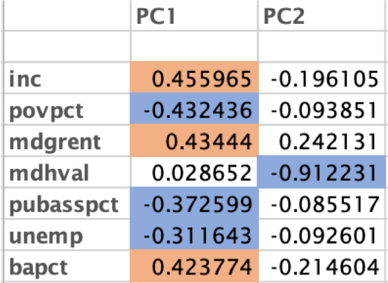

```{r setup, include=FALSE, fig.width=5, fig.asp=1}

library(float)
library(tidyverse)
library(knitr)
library(ggplot2)
library(knitr)
library(MBESS)
library(dplyr)
library(ppcor)
library(corrplot)
library(Hmisc)
library(dplyr)
library(kableExtra)
library(pander)
library(sjPlot)
library(sjmisc)
library(sjlabelled)
library(tableone)
library(dplyr)
library(tableone)
library(pander)
library(furniture)
library(knitr)
library(tableone)
library(dgof)

knitr::opts_chunk$set(warning=FALSE, message=FALSE, error = FALSE)
```


```{r, data-readin PrepTableQ4, include=FALSE, echo=FALSE, warning=FALSE}

# Read in dataset

#LGI Data 
rm(list=ls()) ## clear the workspace
#dev.off() ## Clear the plots


LGI_data_q4 = read.csv('/Users/lolson/Documents/001_JDP/001_BDIL/006_Projects/11_ToddlerSES/todanatomicaldata/tod-anatomical-scripts/q45/SES_Anat_v2_q45.csv')

LGI_data_q4$dxCoded <- as.factor(LGI_data_q4$Dx) # 1 = ASD, 2 = TD
LGI_data_q4$dxCoded <-unclass(LGI_data_q4$dxCoded)
 
LGI_data_q4$sexCoded <- as.factor(LGI_data_q4$SEX) # 1 = Female, 2 = Male
LGI_data_q4$sexCoded <-unclass(LGI_data_q4$sexCoded)

LGI_data_q3 = read.csv('/Users/lolson/Documents/001_JDP/001_BDIL/006_Projects/11_ToddlerSES/todanatomicaldata/tod-anatomical-scripts/q45/SES_Anat_v2.csv')

LGI_data_q3$dxCoded <- as.factor(LGI_data_q3$Dx) # 1 = ASD, 2 = TD
LGI_data_q3$dxCoded <-unclass(LGI_data_q3$dxCoded)
 
LGI_data_q3$sexCoded <- as.factor(LGI_data_q3$SEX) # 1 = Female, 2 = Male
LGI_data_q3$sexCoded <-unclass(LGI_data_q3$sexCoded)


CT_data_q3 = read.csv('/Users/lolson/Documents/001_JDP/001_BDIL/006_Projects/11_ToddlerSES/todanatomicaldata/tod-anatomical-scripts/q45/Lang_CT_SES.csv')

CT_data_q3$dxCoded <- as.factor(CT_data_q3$Dx) # 1 = ASD, 2 = TD
CT_data_q3$dxCoded <-unclass(CT_data_q3$dxCoded)
 
CT_data_q3$sexCoded <- as.factor(CT_data_q3$SEX) # 1 = Female, 2 = Male
CT_data_q3$sexCoded <-unclass(CT_data_q3$sexCoded)

CT_data_q4 = read.csv('/Users/lolson/Documents/001_JDP/001_BDIL/006_Projects/11_ToddlerSES/todanatomicaldata/tod-anatomical-scripts/q45/Lang_CT_SES_q45.csv')


CT_data_q4$dxCoded <- as.factor(CT_data_q4$Dx) # 1 = ASD, 2 = TD
CT_data_q4$dxCoded <-unclass(CT_data_q4$dxCoded)
 
CT_data_q4$sexCoded <- as.factor(CT_data_q4$SEX) # 1 = Female, 2 = Male
CT_data_q4$sexCoded <-unclass(CT_data_q4$sexCoded)


SA_data_q3 = read.csv('/Users/lolson/Documents/001_JDP/001_BDIL/006_Projects/11_ToddlerSES/todanatomicaldata/tod-anatomical-scripts/q45/SA_SES.csv')

SA_data_q3$dxCoded <- as.factor(SA_data_q3$Dx) # 1 = ASD, 2 = TD
SA_data_q3$dxCoded <-unclass(SA_data_q3$dxCoded)
 
SA_data_q3$sexCoded <- as.factor(SA_data_q3$SEX) # 1 = Female, 2 = Male
SA_data_q3$sexCoded <-unclass(SA_data_q3$sexCoded)

SA_data_q4 = read.csv('/Users/lolson/Documents/001_JDP/001_BDIL/006_Projects/11_ToddlerSES/todanatomicaldata/tod-anatomical-scripts/q45/SA_SES_q45.csv')


SA_data_q4$dxCoded <- as.factor(SA_data_q4$Dx) # 1 = ASD, 2 = TD
SA_data_q4$dxCoded <-unclass(SA_data_q4$dxCoded)
 
SA_data_q4$sexCoded <- as.factor(SA_data_q4$SEX) # 1 = Female, 2 = Male
SA_data_q4$sexCoded <-unclass(SA_data_q4$sexCoded)

LGI_data_q3_ASD <- subset(LGI_data_q3, LGI_data_q3$Dx == "ASD")
LGI_data_q3_TD <- subset(LGI_data_q3, LGI_data_q3$Dx == "TD")

LGI_data_q4_ASD <- subset(LGI_data_q4, LGI_data_q4$Dx == "ASD")
LGI_data_q4_TD <- subset(LGI_data_q4, LGI_data_q4$Dx == "TD")
```


## Aim

- Examine associations between SES variables and Anatomical Features of Language Regions in young children with and without ASD
- Conduct sensitivity analyses to examine whether findings are robust to the inclusion of data rated Q>=3 (vs. Q>=4)

## Analytical Approach: Anatomical Measures

- Local Gyrification Index (LGI)
- Cortical Thickness
- Surface Area

## Analytical Approach: SES Measures

- Income:Needs Ratio (household income divided by federal poverty level, adjusted for household size) 
- Maternal Educational Level
- Median Income by Postal Code
- Neighborhood Advantage Index
    - PCA on neighborhood variables at the census tract level
    
## Neighborhood Advantage PCA Results

- PCA on neighborhood variables at the census tract level
    - Average Household Income 
    - % Living in Poverty
    - Median Household Rent
    - Median home value
    - % of Households with public assistance
    - % of Individuals with a bachelor’s degree
    - 

## Participants Q>=4
```{r, PrepareParticipantTable Q>4, include=FALSE, echo=FALSE, warning=FALSE}
# Create a table of some chicken weight summary statistics using dplyr

#library(compareGroups)

# my_maze_names <- c("Diagnosis", "Sex", "Age", "MEL", "Income:Needs", "zipIncome", "SES1", "Exp. Lang. T", "Rec Lang T", "ELC SS", "TBV")
# ## Vector of variables to summarize
# my_num_vars <- c("V1.Age", "MEL_cat", "INR", "zipIncome", "SES1", "ExpLang_T", "RecLang_T", "ELC_SS", "TBV")
# ## Vector of categorical variables that need transformation
# my_cat_vars <- c("Dx", "SEX")
# ## Create a TableOne object
# tab2 <-  CreateTableOne(vars = my_num_vars, strata = "Dx" , data = LGI_data_q4)
# print(tab2, showAllLevels = TRUE)


tableDataQ4 = LGI_data_q4[,c('Dx', 'SEX', 'V1.Age', 'MEL_cat', 'INR', 'zipIncome', 'SES1', 'ExpLang_T', 'RecLang_T', 'ELC_SS', 'TBV')]

listVars <- c("SEX", "V1.Age", "MEL_cat", "INR", "zipIncome", "SES1", "ExpLang_T", "RecLang_T", "ELC_SS", "TBV")

catVars <- c("Dx")

table1 <- CreateTableOne(vars = listVars, data = LGI_data_q4, factorVars = catVars, strata = c("Dx"))

table_one_matrix <- print(table1,
  includeNA = FALSE,
  showAllLevels = TRUE
)


```


## Participants Q>=3

```{r, PrepareParticipantTable Q>3, include=FALSE, echo=FALSE, warning=FALSE}
# Create a table of some chicken weight summary statistics using dplyr

#library(compareGroups)


tableDataQ3 = LGI_data_q3[,c('Dx', 'SEX', 'V1.Age', 'MEL_cat', 'INR', 'zipIncome', 'SES1', 'ExpLang_T', 'RecLang_T', 'ELC_SS', 'TBV')]

listVars <- c("SEX", "V1.Age", "MEL_cat", "INR", "zipIncome", "SES1", "ExpLang_T", "RecLang_T", "ELC_SS", "TBV")

catVars <- c("Dx")

table1 <- CreateTableOne(vars = listVars, data = LGI_data_q3, factorVars = catVars, strata = c("Dx"))

table_two_matrix <- print(table1,
  includeNA = FALSE,
  showAllLevels = TRUE
)


```


```{r, PrintParticipantTable Q>3, include=TRUE, echo=FALSE, warning=FALSE}

pandoc_table <- pandoc.table(table_one_matrix,
  split.table = Inf,
  style = "rmarkdown",
  caption = "Participant Summary Table for Q>=4") 


pandoc_table <- pandoc.table(table_two_matrix,
  split.table = Inf,
  style = "rmarkdown",
  caption = "Participant Summary Table for Q>=3") 


```

## Distributions of Variables: Neighborhood Advantage, Q>=4 

```{r Histograms SES1 Q4, include=TRUE, echo=FALSE, warning=FALSE, fig.width=5, fig.asp=1}
qplot(LGI_data_q4_ASD$SES1,
      geom="histogram",
      binwidth =  1,  
      main = "Histogram for Neighborhood Advantage: ASD Q>=4", 
      xlab = "Neighborhood Advantage",  
      fill=I("red"), 
      col=I("black"),
      ylim = c(0,9),
      xlim=c(-5,5))


qplot(LGI_data_q4_TD$SES1,
      geom="histogram",
      binwidth = 1,  
      main = "Histogram for Neighborhood Advantage: TD, Q>=4", 
      xlab = "Neighborhood Advantage",  
      fill=I("blue"), 
      col=I("black"),
      ylim = c(0,9),
      xlim=c(-5,5))


#completeASD <- LGI_data_q3_ASD$SES1[complete.cases(LGI_data_q3_ASD$SES1)]
#completeTD <- LGI_data_q3_TD$SES1[complete.cases(LGI_data_q3_TD$SES1)]


kstest2 <- ks.test(LGI_data_q4_ASD$SES1, LGI_data_q4_TD$SES1)

```

**Q>=4** Kolmogorov Smirnov Test: D=0.27, *p* = 0.25 (distributions not significantly different from one another).


## Neighborhood Advantage Histograms, Q>=3
```{r Histograms SES1 Q3, include=TRUE, echo=FALSE, warning=FALSE, fig.width=5, fig.asp=1}


qplot(LGI_data_q3_ASD$SES1,
      geom="histogram",
      binwidth =  1,  
      main = "Histogram for Neighborhood Advantage: ASD Q>=3", 
      xlab = "Neighborhood Advantage",  
      fill=I("red"), 
      col=I("black"),
      ylim = c(0,9),
      xlim=c(-5,5))


qplot(LGI_data_q3_TD$SES1,
      geom="histogram",
      binwidth = 1,  
      main = "Histogram for Neighborhood Advantage: TD, Q>=3", 
      xlab = "Neighborhood Advantage",  
      fill=I("blue"), 
      col=I("black"),
      ylim = c(0,9),
      xlim=c(-5,5))


#completeASD <- LGI_data_q3_ASD$SES1[complete.cases(LGI_data_q3_ASD$SES1)]
#completeTD <- LGI_data_q3_TD$SES1[complete.cases(LGI_data_q3_TD$SES1)]

kstest1 <- ks.test(LGI_data_q3_ASD$SES1, LGI_data_q3_TD$SES1)


```

**Q>=3** Kolmogorov Smirnov Test: D=0.21, *p* = 0.46 (distributions not significantly different from one another).


## Histograms: INR Q>=4

```{r Histograms INR Q4, include=TRUE, echo=FALSE, warning=FALSE, fig.width=5, fig.asp=1}

qplot(LGI_data_q4_ASD$INR,
      geom="histogram",
      binwidth =  1,  
      main = "Histogram for Income-to-Needs Ratio: ASD, Q>=4", 
      xlab = "Income:Needs Ratio",  
      fill=I("red"), 
      col=I("black"),
      ylim = c(0,9),
      xlim=c(-1,11))


qplot(LGI_data_q4_TD$INR,
      geom="histogram",
      binwidth = 1,  
      main = "Histogram for Income-to-Needs Ratio: TD, Q>=4", 
      xlab = "Income:Needs Ratio",  
      fill=I("blue"), 
      col=I("black"),
      ylim = c(0,9),
      xlim=c(-1,11))


rm(kstest1)
rm(kstest2)
kstest1 <- ks.test(LGI_data_q3_ASD$INR, LGI_data_q3_TD$INR)
kstest2 <- ks.test(LGI_data_q4_ASD$INR, LGI_data_q4_TD$INR)
```

**Q>=4** Kolmogorov Smirnov Test: D=0.42, *p* = 0.04 (distributions **are** significantly different from one another).


## INR Histograms, Q>=3
```{r Histograms INR Q3, include=TRUE, echo=FALSE, warning=FALSE, fig.width=5, fig.asp=1}


qplot(LGI_data_q3_ASD$INR,
      geom="histogram",
      binwidth =  1,  
      main = "Histogram for Income-to-Needs Ratio: ASD, Q>=3", 
      xlab = "Income:Needs Ratio",  
      fill=I("red"), 
      col=I("black"),
      ylim = c(0,9),
      xlim=c(-1,11))


qplot(LGI_data_q3_TD$INR,
      geom="histogram",
      binwidth = 1,  
      main = "Histogram for Income-to-Needs Ratio: TD, Q>=3", 
      xlab = "Income:Needs Ratio",  
      fill=I("blue"), 
      col=I("black"),
      ylim = c(0,9),
      xlim=c(-1,11))

rm(kstest1)
rm(kstest2)
kstest1 <- ks.test(LGI_data_q3_ASD$INR, LGI_data_q3_TD$INR)
kstest2 <- ks.test(LGI_data_q4_ASD$INR, LGI_data_q4_TD$INR)
```

**Q>=3** Kolmogorov Smirnov Test: D=0.36, *p* = 0.06 (distributions **not** significantly different from one another).


## Histograms, MEL Q>=4

```{r Histograms MEL Q4, include=TRUE, echo=FALSE, warning=FALSE, fig.width=5, fig.asp=1}

qplot(LGI_data_q4_ASD$MEL_cat,
      geom="histogram",
      binwidth =  1,  
      main = "Histogram for MEL: ASD, Q>=4", 
      xlab = "Maternal Educational Level",  
      fill=I("red"), 
      col=I("black"),
      ylim = c(0,13),
      xlim=c(0,8))


qplot(LGI_data_q4_TD$MEL_cat,
      geom="histogram",
      binwidth = 1,  
      main = "Histogram for MEL: TD, Q>=4", 
      xlab = "Maternal Educational Level",  
      fill=I("blue"), 
      col=I("black"),
      ylim = c(0,13),
      xlim=c(0,8))


rm(kstest1)
rm(kstest2)
kstest1 <- ks.test(LGI_data_q3_ASD$MEL_cat, LGI_data_q3_TD$MEL_cat)
kstest2 <- ks.test(LGI_data_q4_ASD$MEL_cat, LGI_data_q4_TD$MEL_cat)
```

**Q>=4** Kolmogorov Smirnov Test: D=0.36, *p* = 0.11 (distributions not significantly different from one another).


## MEL Histograms, Q>=3
```{r Histograms MEL Q3, include=TRUE, echo=FALSE, warning=FALSE, fig.width=5, fig.asp=1}


qplot(LGI_data_q3_ASD$MEL_cat,
      geom="histogram",
      binwidth =  1,  
      main = "Histogram for MEL: ASD, Q>=3", 
      xlab = "Maternal Educational Level",  
      fill=I("red"), 
      col=I("black"),
      ylim = c(0,13),
      xlim=c(0,8))


qplot(LGI_data_q3_TD$MEL_cat,
      geom="histogram",
      binwidth = 1,  
      main = "Histogram for MEL: TD, Q>=3", 
      xlab = "Maternal Educational Level",  
      fill=I("blue"), 
      col=I("black"),
      ylim = c(0,13),
      xlim=c(0,8))

rm(kstest1)
rm(kstest2)
kstest1 <- ks.test(LGI_data_q3_ASD$MEL_cat, LGI_data_q3_TD$MEL_cat)
kstest2 <- ks.test(LGI_data_q4_ASD$MEL_cat, LGI_data_q4_TD$MEL_cat)
```


**Q>=3** Kolmogorov Smirnov Test: D=0.32, *p* = 0.11 (distributions not significantly different from one another).


## Histograms: Zip-Income Q>=4

```{r Histograms ZipIncome Q4, include=TRUE, echo=FALSE, warning=FALSE, fig.width=5, fig.asp=1}

qplot(LGI_data_q4_ASD$zipIncome,
      geom="histogram",
      binwidth =  5000,  
      main = "Histogram for Zip-Income: ASD, Q>=4", 
      xlab = "Median Income (Postal Code)",  
      fill=I("red"), 
      col=I("black"),
      #ylim = c(0,13),
      xlim=c(20000,100000))


qplot(LGI_data_q4_TD$zipIncome,
      geom="histogram",
      binwidth = 5000,  
      main = "Histogram for Zip-Income: TD, Q>=4", 
      xlab = "Median Income (Postal Code)", 
      fill=I("blue"), 
      col=I("black"),
      # ylim = c(0,13),
      xlim=c(20000,100000))


rm(kstest1)
rm(kstest2)
kstest1 <- ks.test(LGI_data_q3_ASD$zipIncome, LGI_data_q3_TD$zipIncome)
kstest2 <- ks.test(LGI_data_q4_ASD$zipIncome, LGI_data_q4_TD$zipIncome)


```

**Q>=4** Kolmogorov Smirnov Test: D=0.22, *p* = 0.67 (distributions not significantly different from one another).


## MEL Histograms, Q>=3
```{r Histograms ZipIncome Q3, include=TRUE, echo=FALSE, warning=FALSE, fig.width=5, fig.asp=1}


qplot(LGI_data_q3_ASD$zipIncome,
      geom="histogram",
      binwidth =  5000,  
      main = "Histogram for Zip-Income: ASD, Q>=3", 
      xlab = "Median Income (Postal Code)",  
      fill=I("red"), 
      col=I("black"),
      #ylim = c(0,13),
      xlim=c(20000,100000))


qplot(LGI_data_q3_TD$zipIncome,
      geom="histogram",
      binwidth = 5000,  
      main = "Histogram for Zip-Income: TD, Q>=3", 
      xlab = "Median Income (Postal Code)", 
      fill=I("blue"), 
      col=I("black"),
      # ylim = c(0,13),
      xlim=c(20000,100000))


rm(kstest1)
rm(kstest2)
kstest1 <- ks.test(LGI_data_q3_ASD$zipIncome, LGI_data_q3_TD$zipIncome)
kstest2 <- ks.test(LGI_data_q4_ASD$zipIncome, LGI_data_q4_TD$zipIncome)


```

**Q>=3** Kolmogorov Smirnov Test: D=0.2, *p* = 0.64 (distributions not significantly different from one another).


## Histograms: Age Q>=4

```{r Histograms Age Q4, include=TRUE, echo=FALSE, warning=FALSE, fig.width=5, fig.asp=1}

qplot(LGI_data_q4_ASD$V1.Age,
      geom="histogram",
      binwidth =  4,  
      main = "Histogram for Age: ASD, Q>=4", 
      xlab = "Age (Months)",  
      fill=I("red"), 
      col=I("black"),
      ylim = c(0,5),
      xlim=c(15,75))


qplot(LGI_data_q4_TD$V1.Age,
      geom="histogram",
      binwidth =  4,  
      main = "Histogram for Age: TD, Q>=4", 
      xlab = "Age (Months)",  
      fill=I("blue"), 
      col=I("black"),
      ylim = c(0,5),
      xlim=c(15,75))


rm(kstest1)
rm(kstest2)
kstest1 <- ks.test(LGI_data_q3_ASD$V1.Age, LGI_data_q3_TD$V1.Age)
kstest2 <- ks.test(LGI_data_q4_ASD$V1.Age, LGI_data_q4_TD$V1.Age)

```

**Q>=4** Kolmogorov Smirnov Test: D=0.09, *p* = 0.99 (distributions not significantly different from one another).


## Age Histograms, Q>=3

```{r Histograms Age Q3, include=TRUE, echo=FALSE, warning=FALSE, fig.width=5, fig.asp=1}


qplot(LGI_data_q3_ASD$V1.Age,
      geom="histogram",
      binwidth =  4,  
      main = "Histogram for Age: ASD, Q>=3", 
      xlab = "Age (Months)",  
      fill=I("red"), 
      col=I("black"),
      ylim = c(0,5),
      xlim=c(15,75))


qplot(LGI_data_q3_TD$V1.Age,
      geom="histogram",
      binwidth =  4,  
      main = "Histogram for Age: TD, Q>=3", 
      xlab = "Age (Months)",  
      fill=I("blue"), 
      col=I("black"),
      ylim = c(0,5),
      xlim=c(15,75))

rm(kstest1)
rm(kstest2)
kstest1 <- ks.test(LGI_data_q3_ASD$V1.Age, LGI_data_q3_TD$V1.Age)
kstest2 <- ks.test(LGI_data_q4_ASD$V1.Age, LGI_data_q4_TD$V1.Age)

```

**Q>=3** Kolmogorov Smirnov Test: D=0.12, *p* = 0.96 (distributions not significantly different from one another).


## Anatomical Regions
- From Desikan-Killiany Atlas
    - Transverse temporal gyrus
    - Superior temporal gyrus 
    - Middle temporal gyrus
    - Inferior Frontal Gyrus 
        - Pars Opercularis 
        - Pars Orbitalis
        - Pars Triangularis
    - 


## LGI Results: INR, Q>=4

```{r, INR LGI Plot Q4, echo = FALSE, include=TRUE, results= 'asis'}
#LGI Data 

outcomes <- LGI_data_q4[,c(7:20)]
outcomeVars = names(outcomes)

    ggplot(LGI_data_q4, aes(x=INR, y=rh_parsopercularis_lgi, color=Dx, shape=Dx)) +
    geom_point() +
    geom_smooth(method=lm, aes(fill=Dx)) +
    scale_color_manual(values=c("red","blue")) +
    scale_fill_manual(values=c("red","blue")) +
    ylab('RH Pars Opercularis LGI') +
    xlab('Income:Needs Ratio') +
    theme_classic()
    
    lm2 <- lm(rh_parsopercularis_lgi ~  INR + TBV + V1.Age, data=LGI_data_q4, na.action = na.exclude)   
cat(tab_model(lm2, pred.labels = c("Intercept", "Income:Needs", "TBV", "Age"),
  dv.labels = paste(outcomeVars[[10]]),
  string.pred = "Coeffcient",
  string.ci = "CI (95%)",
  string.p = "p-Value")$knitr,"\n")

```


Income to needs ratio predicts **rh_parsopercularis_lgi**, controlling for age and TBV in the Q>=4 dataset.


## LGI Results: INR, Q>=3

```{r, INR LGI Plot Q3, echo = FALSE, include=TRUE, results= 'asis'}

rm(outcomes)

outcomes <- LGI_data_q3[,c(7:20)]
outcomeVars = names(outcomes)


    ggplot(LGI_data_q3, aes(x=INR, y=rh_parsopercularis_lgi, color=Dx, shape=Dx)) +
    geom_point() +
    geom_smooth(method=lm, aes(fill=Dx)) +
    scale_color_manual(values=c("red","blue")) +
    scale_fill_manual(values=c("red","blue")) +
    ylab('RH Pars Opercularis LGI') +
    xlab('Income:Needs Ratio') +
    theme_classic()
    
        
lm2 <- lm(rh_parsopercularis_lgi ~  INR + TBV + V1.Age, data=LGI_data_q3, na.action = na.exclude)   
cat(tab_model(lm2, pred.labels = c("Intercept", "Income:Needs", "TBV", "Age"),
  dv.labels = paste(outcomeVars[[10]]),
  string.pred = "Coeffcient",
  string.ci = "CI (95%)",
  string.p = "p-Value")$knitr,"\n")

```

Income to needs ratio predicts **rh_parsopercularis_lgi**, controlling for age and TBV in the Q>=3 dataset. 


## LGI Results, Zip-Income Q>=4

```{r, LGI ZipIncome Plot Q4, echo = FALSE, include=TRUE, results= 'asis'}

rm(outcomes)

outcomes <- LGI_data_q4[,c(7:20)]
outcomeVars = names(outcomes)


    ggplot(LGI_data_q4, aes(x=zipIncome, y=lh_parsorbitalis_lgi, color=Dx, shape=Dx)) +
    geom_point() +
    geom_smooth(method=lm, aes(fill=Dx)) +
    scale_color_manual(values=c("red","blue")) +
    scale_fill_manual(values=c("red","blue")) +
    ylab('LH Pars Orbitalis LGI') +
    xlab('Zip-Income') +
    theme_classic()
    
    lm2 <- lm(lh_parsorbitalis_lgi ~  zipIncome+V1.Age, data=LGI_data_q4, na.action = na.exclude)   
cat(tab_model(lm2, pred.labels = c("Intercept", "Zip-Income", "Age"),
  dv.labels = paste(outcomeVars[[11]]),
  string.pred = "Coeffcient",
  string.ci = "CI (95%)",
  string.p = "p-Value")$knitr,"\n")

```


Zip-Income **is a significant predictor of lh pars orbitalis LGI** when controlling for age (removed TBV because it was not a significant predictor in the model with age and Zip-Income). 


Dx not a significant predictor in this model, nor is the diagnosisXzipIncome interaction term. 


## LGI Results, Zip-Income Q>=3


```{r, LGI ZipIncome Plot Q3, echo = FALSE, include=TRUE, results= 'asis'}

rm(outcomes)

outcomes <- LGI_data_q3[,c(7:20)]
outcomeVars = names(outcomes)


    ggplot(LGI_data_q3, aes(x=zipIncome, y=lh_parsorbitalis_lgi, color=Dx, shape=Dx)) +
    geom_point() +
    geom_smooth(method=lm, aes(fill=Dx)) +
    scale_color_manual(values=c("red","blue")) +
    scale_fill_manual(values=c("red","blue")) +
    ylab('LH Pars Orbitalis LGI') +
    xlab('Zip-Income') +
    theme_classic()
    
    lm2 <- lm(lh_parsorbitalis_lgi ~  zipIncome+V1.Age, data=LGI_data_q3, na.action = na.exclude)   
cat(tab_model(lm2, pred.labels = c("Intercept", "Zip-Income", "Age"),
  dv.labels = paste(outcomeVars[[11]]),
  string.pred = "Coeffcient",
  string.ci = "CI (95%)",
  string.p = "p-Value")$knitr,"\n")

```


Zip-Income **is a significant predictor or lh pars orbitalis LGI** when controlling for age (removed TBV because it was not a significant predictor in the model with age and Zip-Income). 


Dx not a significant predictor in this model, nor is the diagnosisXzipIncome interaction term. 


## CT Results: INR Q>=4

```{r, INR CT Plot Q4 CT, echo = FALSE, include=TRUE, results= 'asis'}
#LGI Data 

outcomes <- CT_data_q4[,c(18:32)]
outcomeVars = names(outcomes)


    ggplot(CT_data_q4, aes(x=INR, y=lh_middletemporal_CT, color=Dx, shape=Dx)) +
    geom_point() +
    geom_smooth(method=lm, aes(fill=Dx)) +
    scale_color_manual(values=c("red","blue")) +
    scale_fill_manual(values=c("red","blue")) +
    ylab('LH Middle Temporal CT') +
    xlab('Income:Needs Ratio') +
    theme_classic()
    
        
lm2 <- lm(lh_middletemporal_CT ~  INR + V1.Age + sexCoded, data=CT_data_q4, na.action = na.exclude)   
cat(tab_model(lm2, pred.labels = c("Intercept", "Income:Needs", "Age", "Sex"),
  dv.labels = paste(outcomeVars[[10]]),
  string.pred = "Coeffcient",
  string.ci = "CI (95%)",
  string.p = "p-Value")$knitr,"\n")

```

INR Predicts **LH middle temporal cortical thickness (CT),**  controlling for age and sex/gender in the Q>=4 dataset. 


## CT Results: INR, Q>=3 Plots

```{r, INR Plots Q3 CT, echo = FALSE, include=TRUE, results= 'asis'}

rm(outcomes)

outcomes <- CT_data_q3[,c(18:32)]
outcomeVars = names(outcomes)


    ggplot(CT_data_q3, aes(x=INR, y=lh_middletemporal_CT, color=Dx, shape=Dx)) +
    geom_point() +
    geom_smooth(method=lm, aes(fill=Dx)) +
    scale_color_manual(values=c("red","blue")) +
    scale_fill_manual(values=c("red","blue")) +
    ylab('LH Middle Temporal CT') +
    xlab('Income:Needs Ratio') +
    theme_classic()

    
        rm(lm2)
    lm2 <- lm(lh_middletemporal_CT ~  INR + V1.Age + sexCoded, data=CT_data_q3, na.action = na.exclude)   
cat(tab_model(lm2, pred.labels = c("Intercept", "Income:Needs", "Age", "Sex"),
  dv.labels = paste(outcomeVars[[1]]),
  string.pred = "Coeffcient",
  string.ci = "CI (95%)",
  string.p = "p-Value")$knitr,"\n")
    


    ggplot(CT_data_q3, aes(x=INR, y=lh_superiortemporal_CT, color=Dx, shape=Dx)) +
    geom_point() +
    geom_smooth(method=lm, aes(fill=Dx)) +
    scale_color_manual(values=c("red","blue")) +
    scale_fill_manual(values=c("red","blue")) +
    ylab('LH Superior Temporal CT') +
    xlab('Income:Needs Ratio') +
    theme_classic()
    
            rm(lm2)
    lm2 <- lm(lh_superiortemporal_CT ~  INR+ V1.Age + sexCoded, data=CT_data_q3, na.action = na.exclude)   
cat(tab_model(lm2, pred.labels = c("Intercept", "Income:Needs", "Age", "Sex"),
  dv.labels = paste(outcomeVars[[2]]),
  string.pred = "Coeffcient",
  string.ci = "CI (95%)",
  string.p = "p-Value")$knitr,"\n")
    
    

    ggplot(CT_data_q3, aes(x=INR, y=rh_parstriangularis_CT, color=Dx, shape=Dx)) +
    geom_point() +
    geom_smooth(method=lm, aes(fill=Dx)) +
    scale_color_manual(values=c("red","blue")) +
    scale_fill_manual(values=c("red","blue")) +
    ylab('RH Pars Triangularis CT') +
    xlab('Income:Needs Ratio') +
    theme_classic()
    
    
lm2 <- lm(rh_parstriangularis_CT ~  INR + V1.Age + sexCoded, data=CT_data_q3, na.action = na.exclude)   
cat(tab_model(lm2, pred.labels = c("Intercept", "Income:Needs", "Age", "Sex"),
  dv.labels = paste(outcomeVars[[14]]),
  string.pred = "Coeffcient",
  string.ci = "CI (95%)",
  string.p = "p-Value")$knitr,"\n")

```


INR Predicts **middle temporal gyrus CT** as well as **lh STG CT** and **rh pars triangularis CT** in the Q>=3 dataset (only predicts middle temporal CT in the Q>=4 dataset).


## CT Results: Neighborhood Advantage (SES1), Q>=4

```{r, SES1 Plots and tables Q4 CT, echo = FALSE, include=TRUE, results= 'asis'}
#LGI Data 

rm(outcomes)
outcomes <- CT_data_q4[,c(18:32)]
outcomeVars = names(outcomes)


    ggplot(CT_data_q4, aes(x=SES1, y=lh_parsopercularis_CT, color=Dx, shape=Dx)) +
    geom_point() +
    geom_smooth(method=lm, aes(fill=Dx)) +
    scale_color_manual(values=c("red","blue")) +
    scale_fill_manual(values=c("red","blue")) +
    ylab('LH Pars Opercularis CT') +
    xlab('Neighborhood Advantage (PC1)') +
    theme_classic()
    
        lm2 <- lm(lh_parsopercularis_CT ~  SES1 + V1.Age + sexCoded, data=CT_data_q4, na.action = na.exclude)   
cat(tab_model(lm2, pred.labels = c("Intercept", "SES1", "Age", "Sex"),
  dv.labels = paste(outcomeVars[[4]]),
  string.pred = "Coeffcient",
  string.ci = "CI (95%)",
  string.p = "p-Value")$knitr,"\n")
    


    ggplot(CT_data_q4, aes(x=SES1, y=rh_middletemporal_CT, color=Dx, shape=Dx)) +
    geom_point() +
    geom_smooth(method=lm, aes(fill=Dx)) +
    scale_color_manual(values=c("red","blue")) +
    scale_fill_manual(values=c("red","blue")) +
    ylab('RH Middle Temporal CT') +
    xlab('Neighborhood Advantage (PC1)') +
    theme_classic()
    
          lm2 <- lm(rh_middletemporal_CT ~  SES1 + V1.Age + sexCoded, data=CT_data_q4, na.action = na.exclude)   
cat(tab_model(lm2, pred.labels = c("Intercept", "SES1", "Age", "Sex"),
  dv.labels = paste(outcomeVars[[9]]),
  string.pred = "Coeffcient",
  string.ci = "CI (95%)",
  string.p = "p-Value")$knitr,"\n")

```


SES1 predicts **lh pars opercularis CT** (controlling for age and sex). 

SES1 predicts **rh middle temporal CT** (controlling for age and sex). 

TBV not a significant predictor of CT in tested regions, therefore removed as a covariate. 


## CT Results, Neighborhood Advantage: Q>=3
```{r, SES1 Plots Q3 CT, echo = FALSE, include=TRUE, results= 'asis'}
#LGI Data 

rm(outcomes)
outcomes <- CT_data_q3[,c(18:32)]
outcomeVars = names(outcomes)


    ggplot(CT_data_q3, aes(x=SES1, y=lh_parsopercularis_CT, color=Dx, shape=Dx)) +
    geom_point() +
    geom_smooth(method=lm, aes(fill=Dx)) +
    scale_color_manual(values=c("red","blue")) +
    scale_fill_manual(values=c("red","blue")) +
    ylab('LH Pars Opercularis CT') +
    xlab('Neighborhood Advantage (PC1)') +
    theme_classic()
    
        lm2 <- lm(lh_parsopercularis_CT ~  SES1 + V1.Age + sexCoded, data=CT_data_q3, na.action = na.exclude)   
cat(tab_model(lm2, pred.labels = c("Intercept", "SES1", "Age", "Sex"),
  dv.labels = paste(outcomeVars[[4]]),
  string.pred = "Coeffcient",
  string.ci = "CI (95%)",
  string.p = "p-Value")$knitr,"\n")
    


    ggplot(CT_data_q3, aes(x=SES1, y=rh_middletemporal_CT, color=Dx, shape=Dx)) +
    geom_point() +
    geom_smooth(method=lm, aes(fill=Dx)) +
    scale_color_manual(values=c("red","blue")) +
    scale_fill_manual(values=c("red","blue")) +
    ylab('RH Middle Temporal CT') +
    xlab('Neighborhood Advantage (PC1)') +
    theme_classic()
    
          lm2 <- lm(rh_middletemporal_CT ~  SES1 + V1.Age + sexCoded, data=CT_data_q3, na.action = na.exclude)   
cat(tab_model(lm2, pred.labels = c("Intercept", "SES1", "Age", "Sex"),
  dv.labels = paste(outcomeVars[[9]]),
  string.pred = "Coeffcient",
  string.ci = "CI (95%)",
  string.p = "p-Value")$knitr,"\n")


```


Associations between SES1 and pars opercularis / middle temporal gyrus are **not significant in the Q>=3 dataset**, controlling for age, sex/gender, and TBV.


## SA Results, INR Q>=4


```{r, INR Plots Q4 SA, echo = FALSE, include=TRUE, results= 'asis'}

rm(outcomes)

outcomes <- SA_data_q4[,c(18:32)]
outcomeVars = names(outcomes)


    ggplot(SA_data_q4, aes(x=INR, y=rh_parsorbitalis_area, color=Dx, shape=Dx)) +
    geom_point() +
    geom_smooth(method=lm, aes(fill=Dx)) +
    scale_color_manual(values=c("red","blue")) +
    scale_fill_manual(values=c("red","blue")) +
    ylab('RH Pars Orbitalis SA') +
    xlab('Income:Needs Ratio') +
    theme_classic()
    
    
    rm(lm2)    
lm2 <- lm(rh_parsorbitalis_area ~  INR + TBV + V1.Age + sexCoded, data=SA_data_q4, na.action = na.exclude)   
cat(tab_model(lm2, pred.labels = c("Intercept", "INR", "TBV", "Age", "Sex"),
  dv.labels = paste(outcomeVars[[13]]),
  string.pred = "Coeffcient",
  string.ci = "CI (95%)",
  string.p = "p-Value")$knitr,"\n")


```

INR is associated with **rh pars orbitalis area** in the Q>=4 dataset, controlling for TBV, age, and sex (although neither age nor sex were significant predictors of RH pars orbitalis SA). 

Dx is also not a significant predictor, and there is no significant Dx by INR interaction.


## SA Results, INR Q>=3

```{r, INR Plots Q3 SA, echo = FALSE, include=TRUE, results= 'asis'}

rm(outcomes)

outcomes <- SA_data_q3[,c(18:32)]
outcomeVars = names(outcomes)


    ggplot(SA_data_q3, aes(x=INR, y=rh_parsorbitalis_area, color=Dx, shape=Dx)) +
    geom_point() +
    geom_smooth(method=lm, aes(fill=Dx)) +
    scale_color_manual(values=c("red","blue")) +
    scale_fill_manual(values=c("red","blue")) +
    ylab('RH Pars Orbitalis SA') +
    xlab('Income:Needs Ratio') +
    theme_classic()
    
    
rm(lm2)    
lm2 <- lm(rh_parsorbitalis_area ~  INR + TBV + V1.Age + sexCoded, data=SA_data_q3, na.action = na.exclude)   
cat(tab_model(lm2, pred.labels = c("Intercept", "INR", "TBV", "Age", "Sex"),
  dv.labels = paste(outcomeVars[[13]]),
  string.pred = "Coeffcient",
  string.ci = "CI (95%)",
  string.p = "p-Value")$knitr,"\n")
    

```

INR is associated with **rh pars orbitalis area** in the Q>=3 dataset, controlling for TBV, age, and sex (although neither age nor sex were significant predictors of RH pars orbitalis SA). 


Dx is also not a significant predictor, and there is no significant Dx by INR interaction.


## SA Results, Neighborhood Advantage: Q>=4

```{r, SES1 Plots Q4 SA, echo = FALSE, include=TRUE, results= 'asis'}

rm(outcomes)

outcomes <- SA_data_q4[,c(18:31)]
outcomeVars = names(outcomes)


    ggplot(SA_data_q4, aes(x=SES1, y=lh_parsorbitalis_area, color=Dx, shape=Dx)) +
    geom_point() +
    geom_smooth(method=lm, aes(fill=Dx)) +
    scale_color_manual(values=c("red","blue")) +
    scale_fill_manual(values=c("red","blue")) +
    ylab('LH Pars Orbitalis SA') +
    xlab('Neighborhood Advantage') +
    theme_classic()
    
    rm(lm2)    
lm2 <- lm(lh_parsorbitalis_area ~  SES1 + TBV + V1.Age, data=SA_data_q4, na.action = na.exclude)   
cat(tab_model(lm2, pred.labels = c("Intercept", "SES1", "TBV", "Age"),
  dv.labels = paste(outcomeVars[[5]]),
  string.pred = "Coeffcient",
  string.ci = "CI (95%)",
  string.p = "p-Value")$knitr,"\n")


  
  

    ggplot(SA_data_q4, aes(x=SES1, y=lh_parsopercularis_area, color=Dx, shape=Dx)) +
    geom_point() +
    geom_smooth(method=lm, aes(fill=Dx)) +
    scale_color_manual(values=c("red","blue")) +
    scale_fill_manual(values=c("red","blue")) +
    ylab('LH Pars Opercularis SA') +
    xlab('Neighborhood Advantage') +
    theme_classic()
    
    
        rm(lm2)    
lm2 <- lm(lh_parsopercularis_area ~  SES1 + TBV + V1.Age, data=SA_data_q4, na.action = na.exclude)   
cat(tab_model(lm2, pred.labels = c("Intercept", "SES1", "TBV", "Age"),
  dv.labels = paste(outcomeVars[[4]]),
  string.pred = "Coeffcient",
  string.ci = "CI (95%)",
  string.p = "p-Value")$knitr,"\n")
    
    

```

Neighborhood advantage is associated with **left hemisphere pars orbitalis and pars opercularis SA,** controlling for TBV and age.


No significant dx by SES1 interaction term, nor dx main effect. 


## SA Results, Neighbohood Advantage: Q>=3
```{r, SES1 Plots and tables Q3 SA, echo = FALSE, include=TRUE, results= 'asis'}

rm(outcomes)

outcomes <- SA_data_q3[,c(18:31)]
outcomeVars = names(outcomes)


    ggplot(SA_data_q3, aes(x=SES1, y=lh_parsorbitalis_area, color=Dx, shape=Dx)) +
    geom_point() +
    geom_smooth(method=lm, aes(fill=Dx)) +
    scale_color_manual(values=c("red","blue")) +
    scale_fill_manual(values=c("red","blue")) +
    ylab('LH Pars Orbitalis SA') +
    xlab('Neighborhood Advantage') +
    theme_classic()
    
    rm(lm2)    
lm2 <- lm(lh_parsorbitalis_area ~  SES1 + TBV + V1.Age, data=SA_data_q3, na.action = na.exclude)   
cat(tab_model(lm2, pred.labels = c("Intercept", "SES1", "TBV", "Age"),
  dv.labels = paste(outcomeVars[[5]]),
  string.pred = "Coeffcient",
  string.ci = "CI (95%)",
  string.p = "p-Value")$knitr,"\n")


    ggplot(SA_data_q3, aes(x=SES1, y=lh_parsopercularis_area, color=Dx, shape=Dx)) +
    geom_point() +
    geom_smooth(method=lm, aes(fill=Dx)) +
    scale_color_manual(values=c("red","blue")) +
    scale_fill_manual(values=c("red","blue")) +
    ylab('LH Pars Opercularis SA') +
    xlab('Neighborhood Advantage') +
    theme_classic()
    
        rm(lm2)    
lm2 <- lm(lh_parsopercularis_area ~  SES1 + TBV + V1.Age, data=SA_data_q3, na.action = na.exclude)   
cat(tab_model(lm2, pred.labels = c("Intercept", "SES1", "TBV", "Age"),
  dv.labels = paste(outcomeVars[[4]]),
  string.pred = "Coeffcient",
  string.ci = "CI (95%)",
  string.p = "p-Value")$knitr,"\n")
    
    

    ggplot(SA_data_q3, aes(x=SES1, y=rh_parstriangularis_area, color=Dx, shape=Dx)) +
    geom_point() +
    geom_smooth(method=lm, aes(fill=Dx)) +
    scale_color_manual(values=c("red","blue")) +
    scale_fill_manual(values=c("red","blue")) +
    ylab('RH Pars Triangularis SA') +
    xlab('Neighborhood Advantage') +
    theme_classic()
    


        rm(lm2)    
lm2 <- lm(rh_parstriangularis_area ~  SES1 + TBV + V1.Age, data=SA_data_q3, na.action = na.exclude)   
cat(tab_model(lm2, pred.labels = c("Intercept", "SES1", "TBV", "Age"),
  dv.labels = paste(outcomeVars[[14]]),
  string.pred = "Coeffcient",
  string.ci = "CI (95%)",
  string.p = "p-Value")$knitr,"\n")

  

```


Neighborhood advantage associated with **left hemisphere and pars orbitalis SA, as in the Q>=4 dataset,** 

Neighborhood advantage is **not significantly associated with  pars opercularis SA** in the Q>=3 dataset (in contrast to Q>=4). 

Neighborhood advantage is also associated with **right hemisphere pars triangularis SA** (not significant in the Q>=4 dataset


## SA Results: Zip-Income, Q>=4


```{r, ZipIncome Plots Q4 SA, echo = FALSE, include=TRUE, results= 'asis'}

rm(outcomes)

outcomes <- SA_data_q4[,c(18:31)]
outcomeVars = names(outcomes)

    ggplot(SA_data_q4, aes(x=zipIncome, y=lh_parsorbitalis_area, color=Dx, shape=Dx)) +
    geom_point() +
    geom_smooth(method=lm, aes(fill=Dx)) +
    scale_color_manual(values=c("red","blue")) +
    scale_fill_manual(values=c("red","blue")) +
    ylab('LH Pars Orbitalis SA') +
    xlab('Median Income (Postal Code)') +
    theme_classic()
    
    
    modelzipIncome_residTBVAge <- lm(zipIncome ~  V1.Age + TBV, data=SA_data_q4, na.action = na.exclude)
zip_residAgeTBV <- resid(modelzipIncome_residTBVAge)

# INR, given Dx, ZipIncome, MEL
modelparsorbit_residAgeTBV <- lm(lh_parsorbitalis_area ~  V1.Age + TBV, data=SA_data_q4, na.action = na.exclude)
lh_parsorbit_area_resid_ageTBV <- resid(modelparsorbit_residAgeTBV)

## Partial Reg Plot SES1 by TBV
#mypath <- file.path("/Users/lolson/Documents/001_JDP/001_BDIL/006_Projects/11_ToddlerSES/todanatomicaldata/scatterPlots/TBV", "TBV_SES1_partialAgeSex.tiff")
#tiff(file=mypath,width = 6, height = 6, units = 'in', res = 300)
ggplot(SA_data_q4, aes(x=zip_residAgeTBV, y=lh_parsorbit_area_resid_ageTBV, color=Dx, shape=Dx)) +
  geom_point() +
  geom_smooth(method=lm, aes(fill=Dx)) +
  scale_color_manual(values=c("red","blue")) +
  scale_fill_manual(values=c("red","blue")) +
  ylab('LH Pars Orbitalis (residualized)')+
  xlab('Median Income by Postal Code (residualized)') +
  labs(title="Partial Reg. Plot: Zip-Income by LH Pars Orbitalis SA") +
  theme_classic()+
  theme(plot.title = element_text(hjust = 0.5))
#dev.off()
    

rm(lm2)    
lm2 <- lm(lh_parsorbitalis_area ~  zipIncome + TBV + V1.Age, data=SA_data_q4, na.action = na.exclude)   
cat(tab_model(lm2, pred.labels = c("Intercept", "Zip-Income", "TBV", "Age"),
  dv.labels = paste(outcomeVars[[5]]),
  string.pred = "Coeffcient",
  string.ci = "CI (95%)",
  string.p = "p-Value")$knitr,"\n")
    

```


Zip-Income is negatively associated with **lh pars orbitalis SA** in the Q>=4 dataset. Visualizing the partial regression plot here also. 


